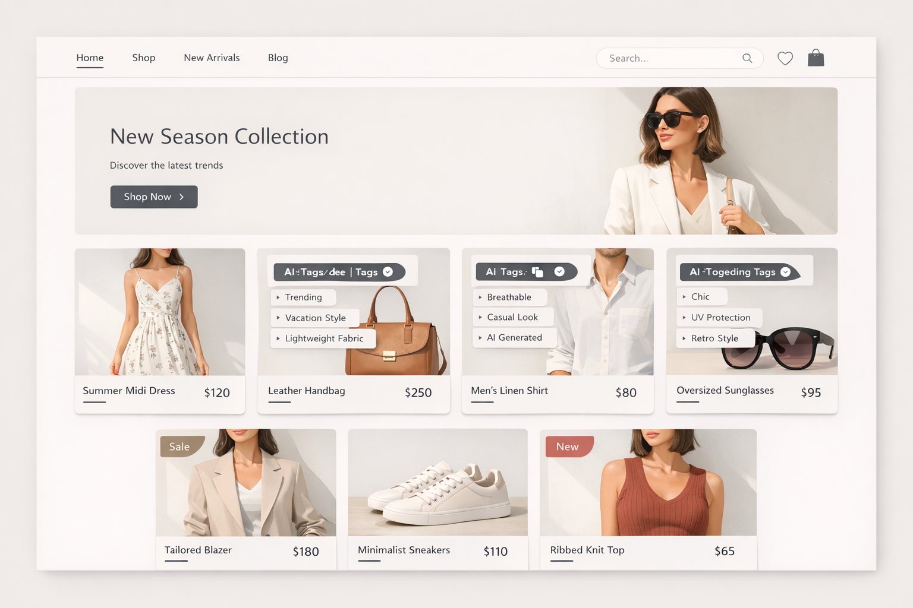

# 🛒🤖 AI Vision Commerce

> An AI-powered e-commerce platform with visual product discovery. Snap a photo, find the product, and try it on virtually.

[](https://opensource.org/licenses/MIT)
[](https://reactjs.org)
[](https://nodejs.org)
[](https://www.typescriptlang.org)
[](https://www.docker.com)
[](https://aws.amazon.com)

## ✨ Features

- **📸 Visual Product Discovery**: Point your camera at any item and instantly find similar products in the store, powered by Google Vision API / Gemini.
- **👓 Virtual Try-On**: See how clothes, shoes, or accessories look on you using Augmented Reality (AR) before you buy.
- **🎬 AI-Generated Video Ads**: Automatically create a 30-second promotional video for any product with an AI avatar presenter (HeyGen/D-ID API).
- **🔍 Semantic AI Search**: Find products using natural language descriptions, not just keywords.
- **💳 Secure Payments**: Integrated with Stripe for seamless and secure checkout.
- **📦 Full CI/CD Pipeline**: Automated testing and deployment to AWS using Docker and GitHub Actions.

## 🛠️ Tech Stack

**Frontend**: React, TypeScript, Tailwind CSS, Redux Toolkit, Three.js (for AR)
**Backend**: Node.js, Express, MongoDB, Mongoose, JWT Authentication
**DevOps**: Docker, GitHub Actions (CI/CD), AWS (ECR, EKS/ECS)
**AI Services**: Google Vision API, Gemini, HeyGen/D-ID API


## 📸 Screenshots




## 🚀 Live Demo

A live version of this project is deployed at: **[Your AWS/Netlify/Vercel URL]**

## 🏁 Quick Start

### Prerequisites
- Node.js (v18+)
- MongoDB (local or Atlas)
- Docker (optional)

### Installation

1. **Clone the repository**
   ```bash
   git clone https://github.com/yourusername/ai-vision-ecommerce.git
   cd ai-vision-ecommerce
